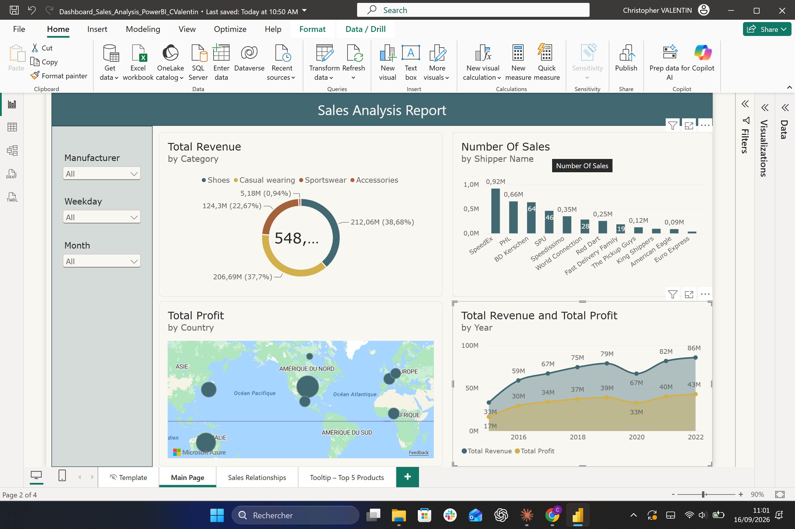
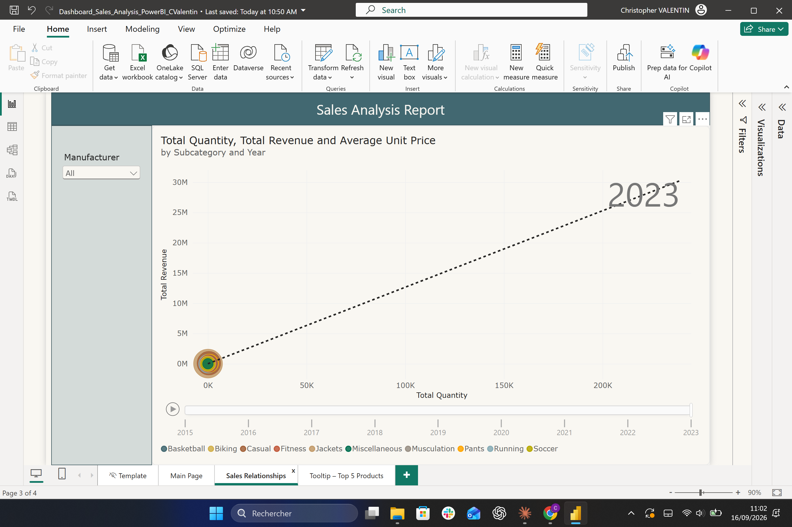
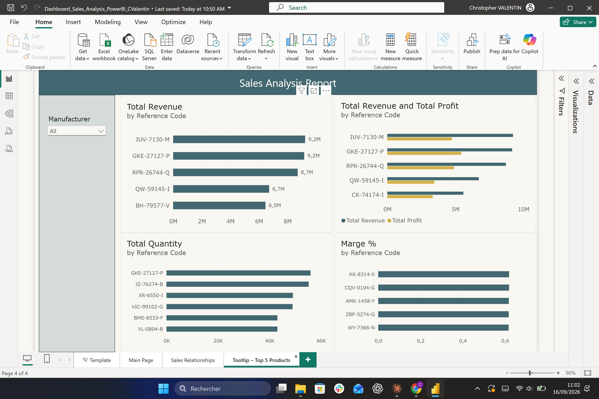

# 📊 Sales Analysis Dashboard — Power BI

Dashboard d'analyse commerciale multi-pages réalisé sous Power BI Desktop, dans le cadre de mon portfolio data en complément de mes projets [Sales Gaming](https://github.com/...) et [Service Clients et Performances](https://github.com/...).

Ce projet illustre ma capacité à construire un rapport BI complet : modélisation de données, mesures DAX, visualisations interactives et mise en forme orientée utilisateur final.

> ⚠️ **Note sur les données** : le jeu de données utilisé m'a été fourni par mon organisme de formation (Datascientest) dans le cadre d'un cours, à des fins d'entraînement. Il ne provient d'aucune entreprise réelle et ne contient aucune donnée confidentielle.

---

## 🔗 Démo en ligne

Le rapport est publié sur Power BI Service et consultable en ligne :

👉 [Accéder à la démo interactive](https://app.powerbi.com/links/n8Afci__-T?ctid=84998eee-081d-4377-8dd3-abad21df88b4&pbi_source=linkShare)

---

## 🖼️ Aperçu du dashboard

### Page principale — Vue d'ensemble des ventes


*Répartition du chiffre d'affaires par catégorie, nombre de ventes par transporteur, profit par pays (carte géographique), et évolution du CA/profit par année.*

### Page relationnelle — Quantité, Revenu et Prix moyen


*Analyse croisée de la quantité vendue, du revenu total et du prix unitaire moyen par sous-catégorie, avec animation temporelle (2015–2023).*

### Page détail — Top 5 Produits


*Focus sur les 5 produits les plus performants : chiffre d'affaires, profit, quantité vendue et marge, pour identifier non seulement les meilleures ventes mais aussi les plus rentables.*

---

## 🧹 Préparation des données

Avant la construction du rapport, un travail de nettoyage et de modélisation a été réalisé dans Power Query et Power BI :

- Nettoyage des données brutes (valeurs manquantes, formats incohérents, doublons)
- Modélisation du schéma en étoile : tables de faits (Sales) reliées aux tables de dimensions (Product, Calendar, Location)
- Création de hiérarchies (dates) et de relations optimisées pour les calculs DAX

## ⚙️ Fonctionnalités clés

- **Modélisation de données** : relations entre tables Sales, Product, Calendar et Location
- **Mesures DAX personnalisées** : Total Revenue, Total Profit, Marge %, Part de marché des Top produits
- **Visuels interactifs** : segments (slicers) par Manufacturer, Weekday et Month, filtres croisés entre visuels
- **Carte géographique** : répartition du profit par pays
- **Page tooltip personnalisée** : détail au survol des produits les plus performants
- **Analyse de rentabilité** : comparaison chiffre d'affaires vs marge, pour dépasser la simple lecture du volume de ventes

---

## 🛠️ Compétences techniques démontrées

| Domaine | Détail |
|---|---|
| Modélisation | Relations entre tables, hiérarchies de dates |
| DAX | Mesures calculées (SUMX, DIVIDE, CALCULATE, TOPN, ALL) |
| Data Visualisation | Choix de visuels adaptés au message (donut, carte, aires empilées, scatter animé) |
| UX Dashboard | Filtres, tooltips personnalisés, cohérence visuelle inter-pages |

---

## 📁 Structure du fichier

```
Dashboard_Sales_Analysis_PowerBI_CValentin.pbix
├── Main Page              → Vue d'ensemble (CA, ventes, profit)
├── Sales Relationships    → Analyse croisée quantité/revenu/prix
└── Tooltip – Top 5 Products → Détail des produits les plus performants
```

---

## 🚀 Utilisation

1. Télécharger le fichier `.pbix`
2. Ouvrir avec **Power BI Desktop** (gratuit)
3. Actualiser les données si nécessaire (`Accueil > Actualiser`)

---

## 👤 Contact

**Christopher Valentin**
Data Analyst / Business Analyst — Paris
📧 crvn14@gmail.com
